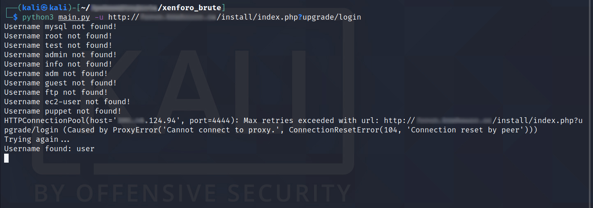

# XenForoEnum
XenForo users bruteforce/enumeration

```
Tested on XenForo 1.5.8 and XenForo 1.5.9

Usage: main.py [-h] [-t THREADS] [-p] -u URL
The following arguments are required: -u/--url
```

# Examples:
```
The file proxy.txt should look like this:
175.110.211.172:8080
212.191.78.146:8080
62.171.177.80:3128

With https proxy: 
python3 main.py -u http://site.com/install/index.php?upgrade/login -p

Without https proxy: 
python3 main.py -u http://site.com/install/index.php?upgrade/login

Custom number of threads (default is 5): 
python3 main.py -u http://site.com/install/index.php?upgrade/login -t 15
```

# How to run script?:
```
git clone https://github.com/f4rber/XenForoEnum
cd XenForoEnum
pip3 install -r requirements.txt
python3 main.py -h
```

# Screenshot:

